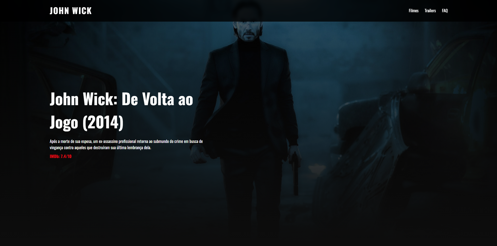
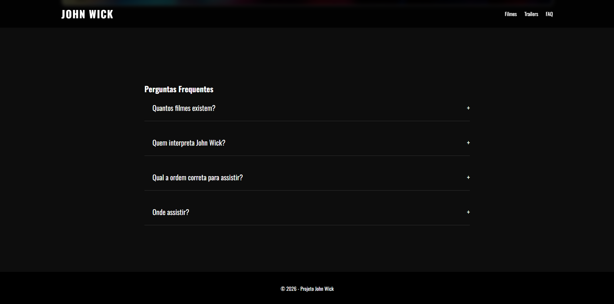

# 🔫 Universo John Wick

Uma landing page inspirada no universo de John Wick, trazendo uma experiência imersiva com visual moderno, animações dinâmicas e uma ambientação baseada na franquia.

---

## 🌐 Acesse o projeto

🔗 https://universo-wick.vercel.app/

---

## 📸 Preview do projeto

<p align="center">
    
</p>
<p align="center">
    
</p>

---

## 📖 Sobre o projeto

O **Universo John Wick** foi desenvolvido com foco em criar uma interface visual inspirada na franquia, apresentando informações sobre os filmes de forma dinâmica e estilizada.

O site conta com banners interativos, trailers incorporados, efeitos visuais e uma seção de perguntas frequentes, proporcionando uma experiência moderna e responsiva para os fãs da saga.

---

## 🚀 Tecnologias utilizadas

- HTML5
- CSS3
- JavaScript

---

## ⚙️ Funcionalidades

- 🎬 Seleção interativa dos filmes
- 🖼️ Alteração dinâmica de banners e conteúdos
- 📺 Trailer incorporado
- ❓ FAQ interativo
- 📱 Layout responsivo
- ✨ Animações e efeitos visuais

---

## 📁 Estrutura do projeto

```bash
john_wick_site/
├── imagens/
├── preview/
├── index.html
├── style.css
├── script.js
└── README.md
```

---

## 💻 Como executar o projeto

```bash
# Clone o repositório
git clone https://github.com/ElMathidones/john_wick_site.git

# Acesse a pasta do projeto
cd john_wick_site
```

Depois, basta abrir o arquivo `index.html` no navegador.

---

## 👨‍💻 Autor

Desenvolvido por **Mathias Méndez**.
